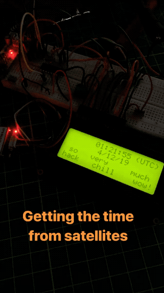
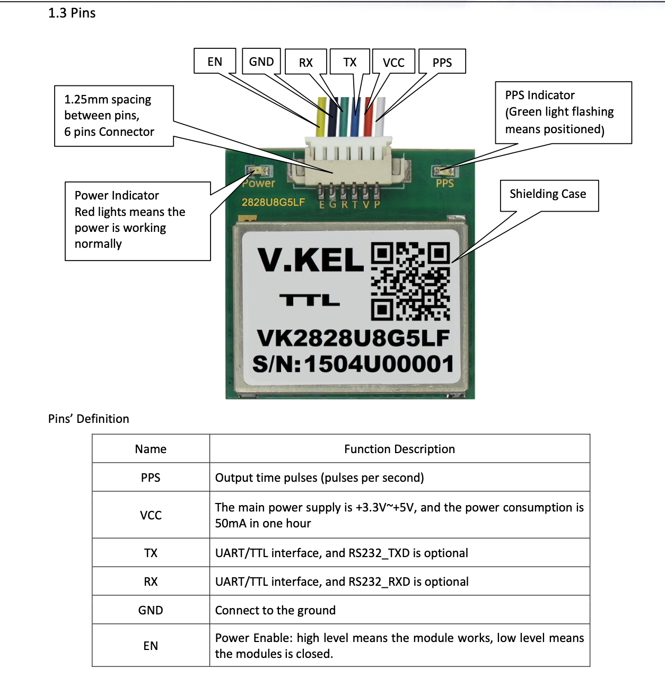

# GPS clock

Uses a GPS receiver and PIC µC to display UTC on LCD

 - Update suggested code/examples to work with an available 20x4 Character LCD display

### Based also on Project

Make a GPS Clock With a PIC Microcontroller

[[PDF]](../../../doc/Make_a_GPS_Clock_With_a_PIC_Microcontroller_-_Projects.pdf)

#### GPS Module Pinout

- GPS Module datasheet [[PDF]](../../../doc/VK2828U7G5LF_Data_Sheet_20150902.pdf)

## Main code

Microchip PIC IDE (MP IDE) was used to build and deploy (using PICkit™3) the code.

 - [gps_clock.c](gps_clock.c)

**Main discoveries**

 - Change setting for X8 compile to using `C90` setting instead of (the default) `C99`
   - affects prototypes for interrupt handler (`tc_int()`) and `getch()`
 - Added `volatile` on the Interrupt/main shared variable `getchar_active` (project seems to work fine without it though)
 - From the example code, change the "gps_header" value from `unsigned char gps_header[]="GPRMC"` to `unsigned char gps_header[]="GNRMC"`
 - 20x4 LCD is treated in HD44870 memory as a two-line display, with row3 being extension of row1, and row4 being extension of row2.
 - LCD initialization was tweaked from 16x2 example code and other examples found on the Internets; got it working but not sure if it's the "best"/proper way

 Some of this information was identified based on comments for the *Instructables* or *Reddit* sub-reddit pages.
